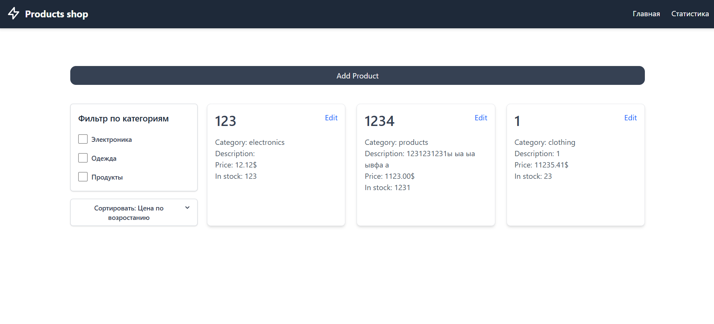

# Product App



### Overview
This is the backend for the Product API, a RESTful service for managing products with CRUD operations and statistics. Built with Node.js, Express, MongoDB, Mongoose, and TypeScript, it follows a clean architecture pattern to ensure maintainability and scalability. The API provides endpoints for creating, reading, updating, and deleting products, as well as retrieving product statistics.

## Prerequisites
- **Docker** installed.
- **Node.js** (optional, for local development without Docker).

- **Postman** (optional, for testing with the provided collection).

### Setup and Running with Docker

The backend is containerized using Docker and orchestrated with Docker Compose, including a MongoDB instance.

1. Clone the Repository
```bash
git clone https://github.com/Navi-Friend/products-api
cd https://github.com/Navi-Friend/products-api
```

2. Start the Application

Run the following command to build and start the backend and MongoDB services:
```bash
docker-compose up --build
```
- The backend will be available at http://localhost:8000/api.

3. Stop the Application

To stop and remove the containers:
```bash
docker-compose down
```
To also remove volumes (including MongoDB data):

```bash
docker-compose down -v
```

## Product API

### API Documentation
The API is documented using a Postman collection:

- Postman Collection: Located at *server/docs/Product_API.postman_collection.json*.

- Import the collection into Postman to test endpoints.

- The collection includes all endpoints (POST /products, GET /products, GET /products/:id, PUT /products/:id, DELETE /products/:id, GET /statistics) with example requests, responses, and tests.

### Functionality
The backend provides the following endpoints:

**POST** */api/products*: Create a new product (requires name, price, quantity, category; description optional).

**GET** */api/products*: Retrieve all products.

**GET** */api/products/:id*: Retrieve a product by ID.

**PUT** */api/products/:id*: Update a product by ID (all fields optional).

**DELETE** */api/products/:id*: Delete a product by ID.

**GET** */api/statistics*: Retrieve statistics (total products, average price, products by category).


### Common errors: 
- **400 (Validation Error)**: Invalid input data or ObjectId.

- **400 (Duplicate Key)**: Duplicate product name.

- **500 (Internal Server Error)**: Unexpected server issues.

## Product Frontend

### Description
A React frontend application with TypeScript, built using modern web technologies.

### Tech Stack
- React 19 (with Hooks)

- TypeScript for static typing

- Vite for build tool

- Tailwind CSS for styling

- Redux Toolkit for state management

- React Query (TanStack Query) for API handling

- React Router for navigation

- Recharts for data visualization

- Zod for data validation

- React Toastify for notifications

### License
MIT